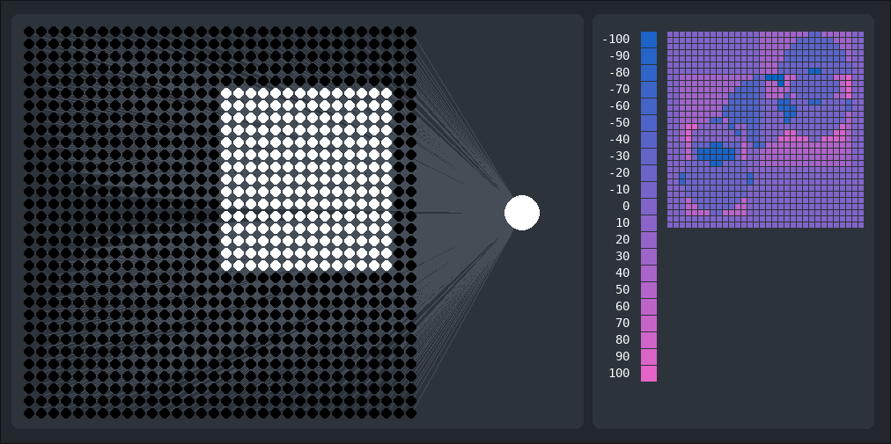
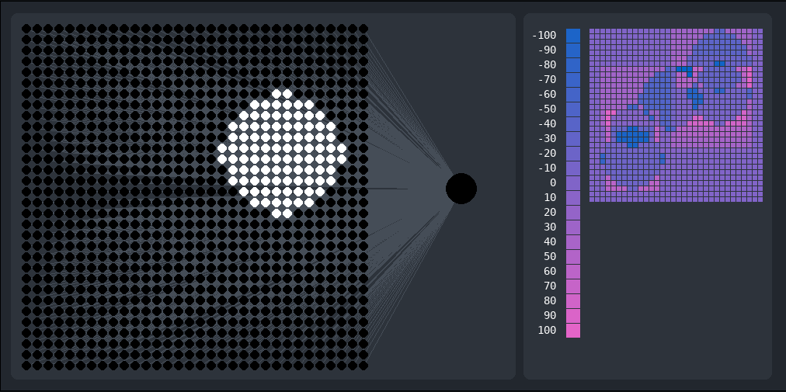

# VNetwork
VNetwork is a Python library which helps you build a neural network and train it.

Yeah you could use Tensorflow, Keras, PyTorch or scikit-learn but I wanted to write my own library, for fun.

<br>

## Use case
[`single-layer-shape-reco`](./single-layer-shape-reco) is a Python program that uses VNetwork module to differentiate rectangles from circles.

Here input layers are arranged in 32x32 grid and their colored by their state value which can be anything from 0 (black) to 1 (white). 
On the right we have another 32x32 grid which shows the biases of nodes.
Trained neural network is presented with an "image" of a rectangle and the output neuron value is set to 1:


And here the neural network is presented with a circle and the output neuron is set to 0:


Also dont look at the code for that (its bad). Its just a proof of concept.

<br>

## Usage
VNetwork has `Network` class which takes `layerplan` argument on initialization. `layerplan` aregument is a 3D array of lists that contain arguments for creating a `Node` object.

Heres an example of creating 3 layer neural network:
```Python
Network(
    layerplan = [
        [[], []],
        [[], [], []],
        [[]]
    ]
)
```

Every item inside the `layerplan` represents a layer. And every item  inside every "layer" represents a `Node` which is a class in `vnetwork.py`. `Node` class takes couple arguments on initialization. In the `layerplan` list we can override the default arguments.

Heres an example of creating a 3 layer neural network with all node's state set to 4:
```Python
Network(
    layerplan = [
        [[4], [4]],
        [[4], [4], [4]],
        [[4]]
    ]
)
```

<br>

Also I made a fun little [presentation](https://youtu.be/1Cwlr1RaOcg) on YouTube.
